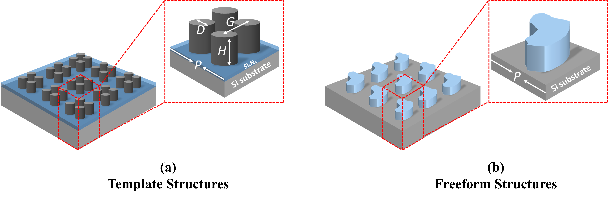
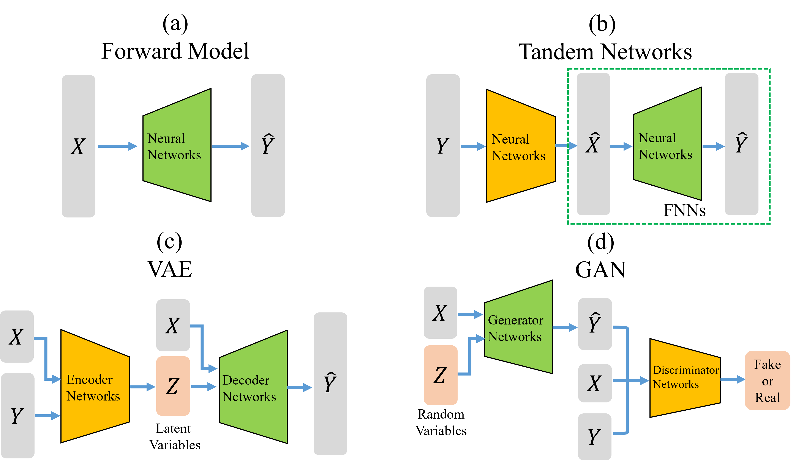
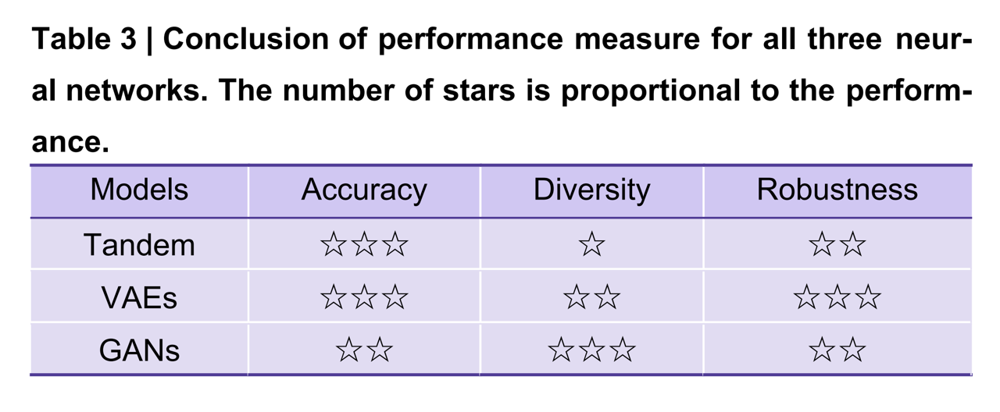

# Benchmarking Deep Learning-based Models on Nanophotonic Inverse Design Problems

This repository is the implementation of paper [Benchmarking deep learning-based models on nanophotonic inverse design problems](https://www.oejournal.org/article/doi/10.29026/oes.2022.210012).

# Introduction
## 1. Two inverse design tasks:

### (a) Template structure: Silicon Nanorods for structural color inverse design. 

This structure can be described by 4 parameters: **Period (P), Diameter (D), Gap (G), and Height (H)**. 

The optical response is reflection structural color. 

### (b) Freeform structure: Transmission spectrum inverse design based on the Si free-from structures. 

This structure is described by a pixlated image. 

The optical response is the transmission. 

## 2. Three examined deep learning models

### (b) [Tandem networks](https://onlinelibrary.wiley.com/doi/10.1002/adma.201905467)
### (c) Variational Auto-Encoders [(VAE)](https://proceedings.neurips.cc/paper/2015/file/8d55a249e6baa5c06772297520da2051-Paper.pdf)
### (d) Generative Adversarial Networks [(GAN)](https://arxiv.org/pdf/1411.1784.pdf)

## 3. Three evaluation metrics



# Usage

## 1. Load the dataset and necessary files

### (1) Task 1: 

The dataset is already included in the folder **'./tasks1_template'**.

### (2) Task 2: 

Please download the dataset, the trained models, the predicted structures (for diversity metrics) from the google drive [folder](https://drive.google.com/drive/folders/1VXDLD6ydglWOBs8TvXCm3-S5YbgiWuU4?usp=sharing), and put it under the folder **'./tasks2_free_form'**. 

## 2. Simulation

All datasets are simulated using the [RCWA reticolo packages](https://zenodo.org/record/3610175#.YlTu6eiZOCq) in MATLAB. You can find its introduction and technical file [here](https://arxiv.org/ftp/arxiv/papers/2101/2101.00901.pdf). We provide examples of simulating the template and free-form structures in the folder **'./RCWA'**.  

### (a) How to simulate the free-form structures?

We treat the free-from structure as a 64\*64 pixlated image. The Reticolo packages allow the definition of inclusions, including rectangles and ellipses. Therefore, an image can be treated as containing 64\*64=4096 rectangle inclusions, where each rectangle inclusion only corresponding to one pixel. We give a code example here. Detailed can be found in the simulation files. 

```
function texture = shape_from_img(img,n_air,n_medium,pixel_unit)
    % MATLAB function
    % Define the texture of arbitrary structures from an image 
    [a, b, width, height] = size(img);
    texture{1} = n_air;
    pixel = [];
    width_shift = width / 2;
    height_shift = height / 2;
    for i = - width_shift + 1:1:width_shift
        for j = -height_shift + 1:1:height_shift
            x = i + width_shift;
            y = j + height_shift;
            if img(1, 1, x,y) <=0.5
            # the binarization threshold
                pixel = [pixel_unit*(i-0.5),pixel_unit*(j-0.5),pixel_unit,pixel_unit,n_air,1];
            else
                pixel = [pixel_unit*(i-0.5),pixel_unit*(j-0.5),pixel_unit,pixel_unit,n_medium,1]; 
            end
            texture = [texture,pixel];
        end
    end   
end

```

The way to generate free-from structures is similar to [this](https://github.com/shapely/shapely). We also give the code to generate images in file './tasks2_free_form/image_process.py'.

# Cite

If you reference or cite this work in your research, please cite: 

Ma TG, Tobah M, Wang HZ, Guo LJ. Benchmarking deep learning-based models on nanophotonic inverse design problems. Opto-Electron Sci 1, 210012 (2022). doi: 10.29026/oes.2022.210012

```
@article{ma2022benchmarking,
  title={Benchmarking deep learning-based models on nanophotonic inverse design problems},
  author={Ma, Taigao and Tobah, Mustafa and Wang, Haozhu and Guo, L Jay},
  journal={Opto-Electronic Science},
  volume={1},
  number={1},
  pages={210012--1},
  year={2022},
  publisher={Opto-Electronic Science}
}
```
